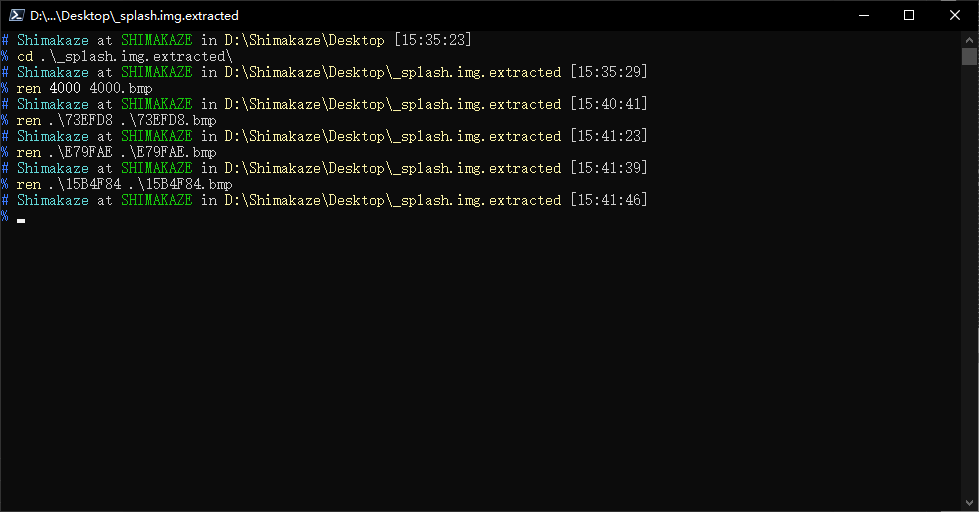

# Splash.Generator
注意: 这个工具是我为了修改我自己的手机的开机启动图制作的  
仅在Redmi Note 7 (lavender)上测试过  

# 使用方法
建议与[binwalk](https://github.com/ReFirmLabs/binwalk)工具搭配使用  

## 准备
准备要替换的图片

0. 使用binwalk工具解析splash.img
    ```bash
    binwalk --dd='.*' splash.img
    ```
    

1. 进入"_splash.img.extracted"目录, 将步骤0中'DESCRIPTION'为'PC bitmap, Windows 3.x format'的'HEXADECIMAL'值相等的文件添加.bmp扩展名  
    

2. 移除非.bmp扩展名的文件
    ```powershell
    $fs = ls;
    foreach($f in $fs){
      if(-not $f.Extension.Equals(".bmp",[System.StringComparison]::OrdinalIgnoreCase)){
        $f.Delete();
      }
    }
    ```
    

## 替换
注意: 请确保图片大小与格式不发生改变  
然后就随便替换就行了

## 生成
0. 将图片和splash.img文件放在同一目录下
1. 在目录下执行工具或将目录作为参数传递
    

## 写入
把生成的splash_new.img刷入即可
```cmd
# 重启进入fastboot
adb reboot fastboot
# 刷入新的splash
fastboot flash splash splash_new.img
# 重启进入系统
fastboot reboot
```