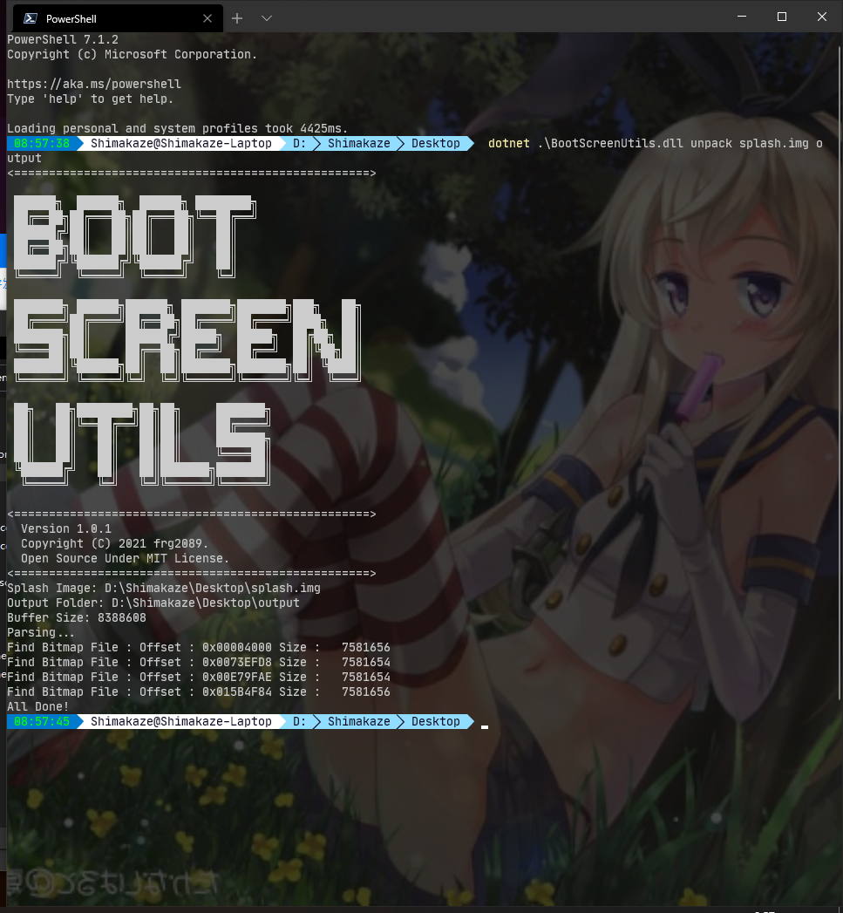
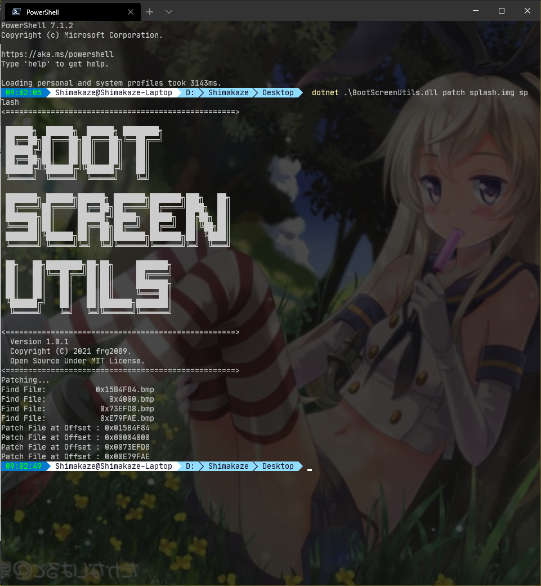

# Splash.Generator
注意: 这个工具是我为了修改我自己的手机的开机启动图制作的  
仅在Redmi Note 7 (lavender)上测试过  

# 使用方法


## 准备
准备要替换的图片

0. 使用工具解析splash.img
    ```powershell
    dotnet BootScreenUtils.dll unpack <splash.img> <output folder> [<buffer size>]
    ```
    

## 替换
注意: 请确保图片大小与格式不发生改变  
然后就随便替换就行了

## 生成
1. 在目录下执行工具或将目录作为参数传递
    ```powershell
    dotnet BootScreenUtils.dll patch <splash.img> <picture folder> [<splash.new.img>]
    ```
    

## 写入
把生成的splash.new.img刷入即可
```cmd
# 重启进入fastboot
adb reboot fastboot
# 刷入新的splash
fastboot flash splash splash_new.img
# 重启进入系统
fastboot reboot
```